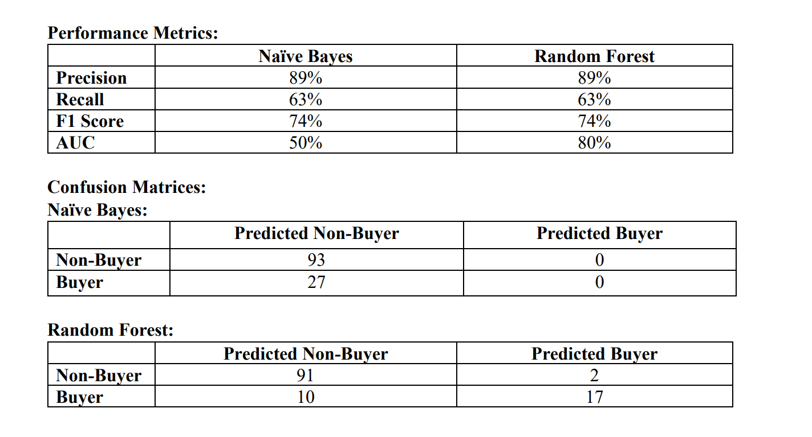
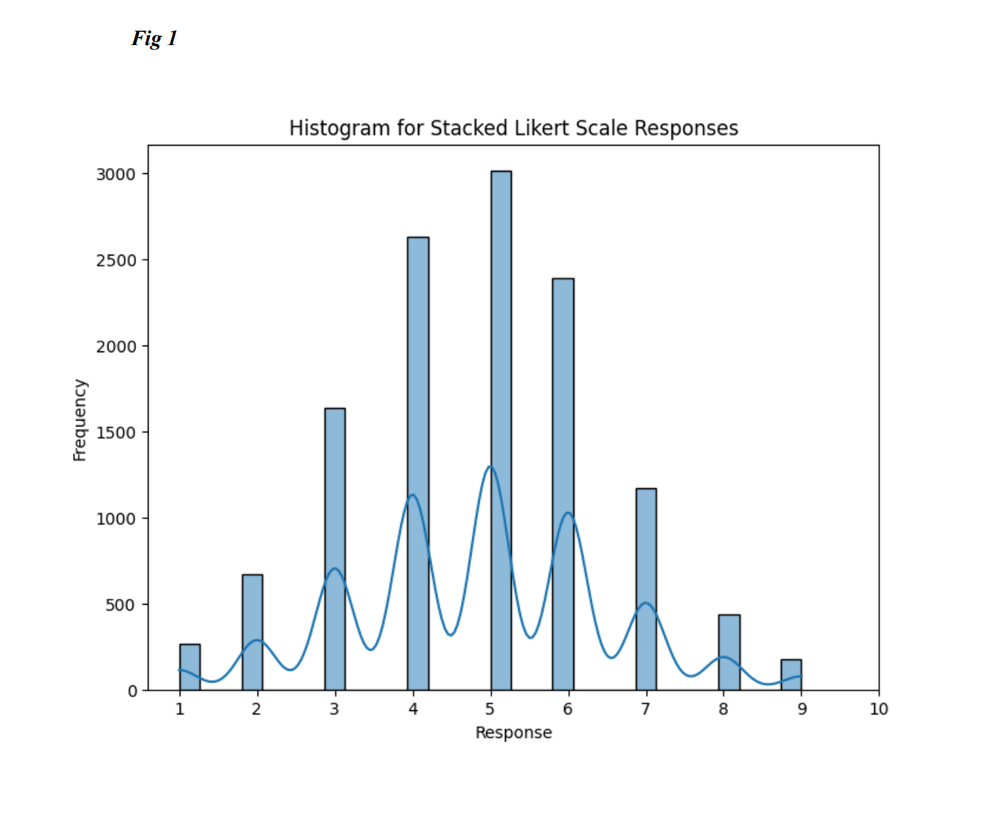
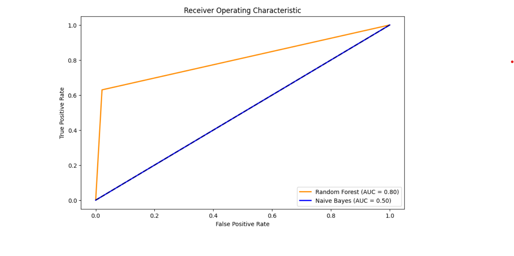

# **Land Rover Marketing Insights: Predicting Customer Preferences**

## **Overview**
This project uses data analysis and machine learning to uncover actionable insights for Land Rover's marketing strategy. By analyzing survey data from 400 participants, I explored the factors influencing SUV purchase intent and developed predictive models to help Land Rover target potential buyers effectively. This project showcases my skills in data preprocessing, visualization, and predictive modeling.

---

## **Features**

- **Data Exploration and Cleaning**:  
  - Processed raw survey data, addressed missing values, and prepared a structured dataset for analysis.  
  - Conducted exploratory analysis to uncover meaningful correlations, such as adventurousness and confidence influencing purchase likelihood.  

- **Dimensionality Reduction**:  
  - Applied **Principal Component Analysis (PCA)** to reduce dimensionality, retaining 83% of data variability while simplifying feature sets.  

- **Machine Learning Models**:  
  - Built and evaluated multiple models for predicting purchase intent:
    - **Linear Regression**: Provided insights into key traits influencing purchase behavior.  
    - **Random Forest Classification**: Achieved a 90% accuracy rate in identifying high-potential buyers, outperforming Naive Bayes.  

- **Visualization**:  
  - Created visualizations such as histograms, correlation heatmaps, and confusion matrices to make the findings easily interpretable.
  

---

## **Technologies Used**
- **Languages and Libraries**:  
  - Python: `pandas`, `NumPy`, `scikit-learn`, `matplotlib`, `seaborn`  
- **Machine Learning Techniques**:  
  - Linear Regression, Principal Component Analysis (PCA), Random Forest, Naive Bayes  
- **Visualization**:  
  - `Matplotlib`, `Seaborn`

---

## **Results**
- Identified 23% of respondents as potential buyers, offering a focused audience for marketing efforts.  
- Highlighted key attributes—confidence, risk-taking, and adventurousness—that correlate strongly with purchase likelihood.  
- Delivered actionable insights with a Random Forest model achieving the highest predictive accuracy (90%).

---

## **Conclusion**
This project strengthened my skills in data analysis, preprocessing, and predictive modeling while addressing a real-world business problem. It highlighted the value of storytelling with data—from cleaning and analysis to presenting insights visually and through machine learning models.
